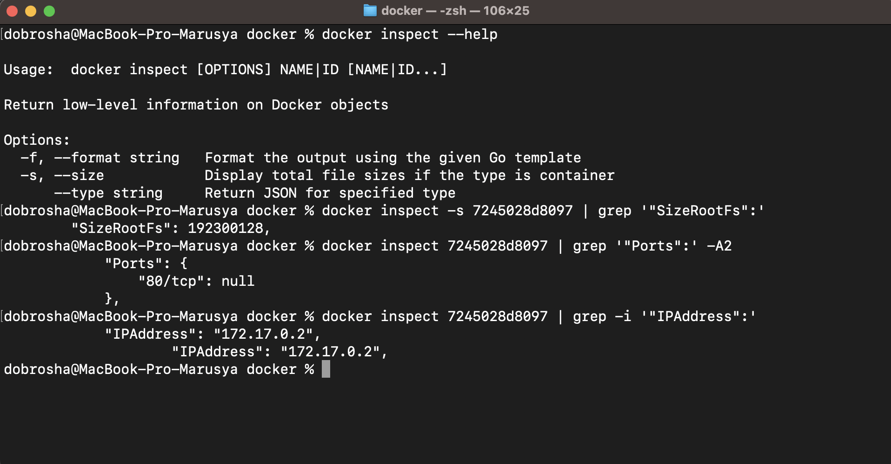
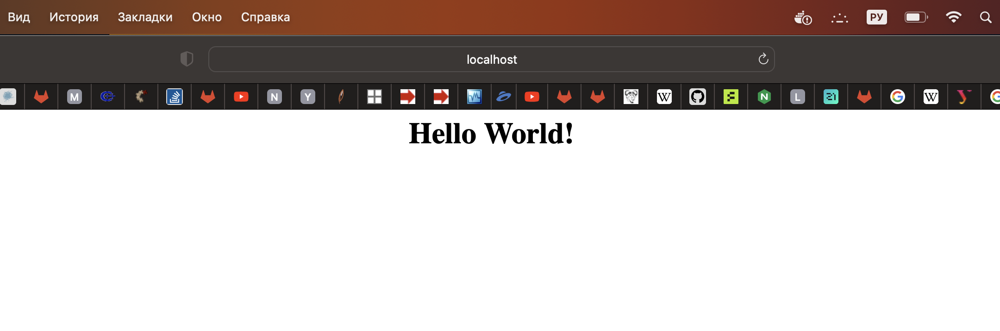
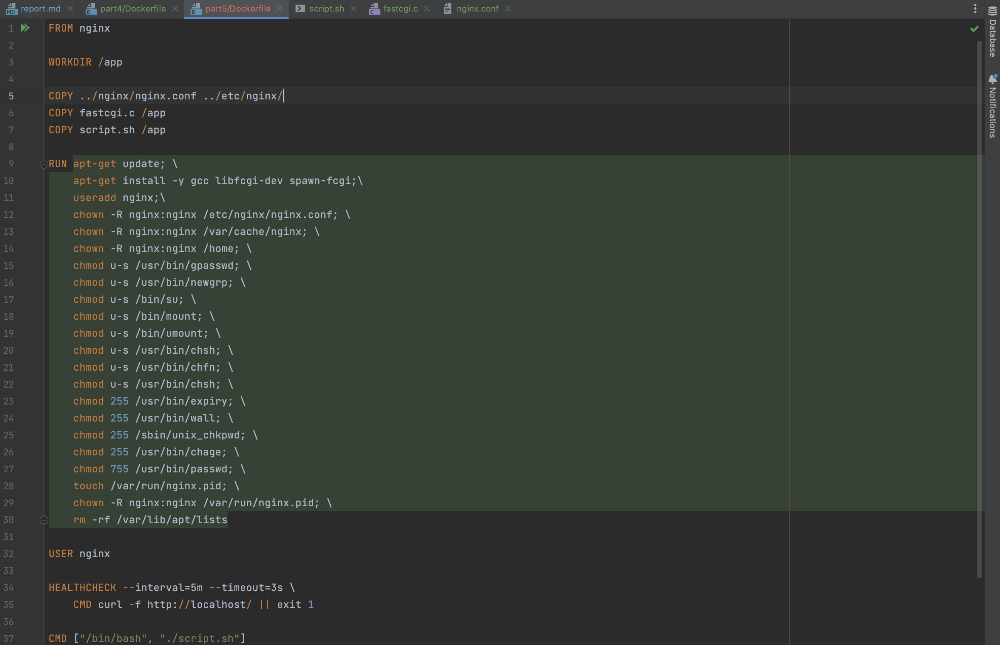

# Simple Docker

Введение в докер. Разработка простого докер образа для собственного сервера.

## Part 1. Готовый докер

* Взять официальный докер образ с nginx и выкачать его при помощи `docker pull`
* Проверить наличие докер образа через `docker images`

* Запустить докер образ через `docker run -d [image_id|repository]`
* Проверить, что образ запустился через `docker ps`
* Посмотреть информацию о контейнере через `docker inspect [container_id|container_name]`

* По выводу команды определить и поместить в отчёт размер контейнера, список замапленных портов и ip контейнера

* Остановить докер образ через `docker stop [container_id|container_name]`
* Проверить, что образ остановился через `docker ps`

* Запустить докер с портами 80 и 443 в контейнере, замапленными на такие же порты на локальной машине, через команду `run`

* Проверить, что в браузере по адресу localhost:80 доступна стартовая страница nginx

* Перезапустить докер контейнер через `docker restart [container_id|container_name]`
* Проверить любым способом, что контейнер запустился

## Part 2. Операции с контейнером

Докер образ и контейнер готовы. Теперь можно покопаться в конфигурации **nginx** и отобразить статус страницы.

* Прочитать конфигурационный файл nginx.conf внутри докер контейнера через команду `exec`

* Создать на локальной машине файл nginx.conf
* Настроить в нем по пути /status отдачу страницы статуса сервера nginx

* Скопировать созданный файл nginx.conf внутрь докер образа через команду docker cp
* Перезапустить nginx внутри докер образа через команду exec

* Проверить, что по адресу localhost:80/status отдается страничка со статусом сервера nginx

* Экспортировать контейнер в файл container.tar через команду export
* Остановить контейнер
* Удалить образ через `docker rmi [image_id|repository]`, не удаляя перед этим контейнеры
* Удалить остановленный контейнер

* Импортировать контейнер обратно через команду import
* Запустить импортированный контейнер
* Проверить, что по адресу localhost:80/status отдается страничка со статусом сервера nginx

* `Active connections` – Количество всех открытых соединений. Это не количество пользователей, которые подключились к сайту, один пользователь для одного просмотра страницы может открыть множество одновременных соединений к серверу.
* `Server accepts handled requests` – Этот параметр показывает, три значения:
* Первый — это количество всех принятых соединений.
* Второй — это количество всех прерванных соединений. Обычно первые 2 значения одинаковы.
* Третий — это количество обрабатывающихся запросов (как правило, данный параметр больше чем второе значение).
* Reading – Количество считанных заголовков запроса в nginx.
* Writing – Nginx читает тело запроса, обрабатывает запрос, или пишет ответ на клиента.
* Waiting – Keep-Alive соединения, на самом деле активно  – (чтение + запись). Эта величина зависит от keepalive-timeout. Это значение можно проигнорировать. 

## Part 3. Мини веб-сервер

* Запускаю контейнер с замапленным портом 81, создаю папку server, обновила контейнер и устанавила в него libfcgi, spawn-fcgi, gcc, make, vim

* Написать мини сервер на C и FastCgi, который будет возвращать простейшую страничку с надписью Hello World!

* Написать свой nginx.conf, который будет проксировать все запросы с 81 порта на 127.0.0.1:8080

* Скопировала файл fastcgi.c в контейнер в папку server и файл nginx.conf в контейнер в папку /etc/nginx/.
* Проверила конфигурацию и перезапустила nginx внутри контейнера

* Скомпилировала файл fastcgi.c в контейнере
* Запустила написанный мини сервер на порту 8080 через `spawn-fcgi`
* Перезапустила nginx

* Проверить, что в браузере по localhost:81 отдается написанная вами страничка

* Положить файл nginx.conf по пути ./nginx/nginx.conf (это понадобится позже)

## Part 4. Свой докер

* Написать свой докер образ, который:
  * собирает исходники мини сервера на FastCgi из Части 3 
  * запускает его на 8080 порту 
  * копирует внутрь образа написанный ./nginx/nginx.conf 
  * запускает nginx.

* Dockerfile:

* script.sh:

* Собрать написанный докер образ через `docker build` при этом указав имя и тег

* Проверить через `docker images`, что все собралось корректно

* Запустить собранный докер образ с маппингом 81 порта на 80 на локальной машине и маппингом папки ./nginx внутрь контейнера по адресу, где лежат конфигурационные файлы nginx'а (см. Часть 2)
* Проверить, что по localhost:80 доступна страничка написанного мини сервера

* Дописать в ./nginx/nginx.conf проксирование странички /status, по которой надо отдавать статус сервера nginx

* Перезапустить докер образ
* Если всё сделано верно, то, после сохранения файла и перезапуска контейнера, конфигурационный файл внутри докер образа должен обновиться самостоятельно без лишних действий
* Проверить, что теперь по localhost:80/status отдается страничка со статусом nginx

## Part 5. **Dockle**

После написания образа никогда не будет лишним проверить его на безопасность.

* Просканировать образ из предыдущего задания через dockle [image_id|repository]

* Исправить образ так, чтобы при проверке через dockle не было ошибок и предупреждений

* Сканирование исправленного образа еще раз

## Part 6. Базовый **Docker Compose**

Написать файл docker-compose.yml, с помощью которого:

1) Поднять докер контейнер из Части 5 (он должен работать в локальной сети, т.е. не нужно использовать инструкцию EXPOSE и мапить порты на локальную машину)
2) Поднять докер контейнер с nginx, который будет проксировать все запросы с 8080 порта на 81 порт первого контейнера
* Замапить 8080 порт второго контейнера на 80 порт локальной машины

* Остановить все запущенные контейнеры

* Собрать и запустить проект с помощью команд docker-compose build и docker-compose up

* Проверить, что в браузере по localhost:80 отдается написанная вами страничка, как и ранее

* В логах виден запрос, который мы отправили из браузера:

