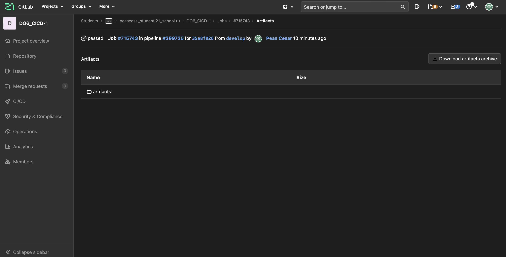

## Part1. Настройка gitlab-runner

+ sudo apt-install gitlab-runner

+ sudo gitlab-runner register

## Part2. Сборка

### Написать этап для CI по сборке приложений из проекта C2_SimpleBashUtils:

+ В файле gitlab-ci.yml добавить этап запуска сборки через мейк файл из проекта C2
+ Файлы, полученные после сборки (артефакты), сохранять в произвольную директорию со сроком хранения 30 дней.
1) Создала файл .gitlab-ci.yml в корне репозитория:

+ успешно отработанный пайплайн:

+ Папка "artifacts" и её содержимое:

## Part3. Тест кодстайла

### Написать этап для CI, который запускает скрипт кодстайла (clang-format):

+ Если кодстайл не прошел, то "зафейлить" пайплайн \
  (Для этого нужно использовать флаг --Werror)
+ В пайплайне отобразить вывод утилиты clang-format (--verbose)

+ yml файл:

+ Убираю все ошибки стиля и снова запускаю пайплайн: 

## Part4. Интеграционные тесты

### Написать этап для CI, который запускает ваши интеграционные тесты из того же проекта:

+ Запускать этот этап автоматически только при условии, если сборка и тест кодстайла прошли успешно
+ Если тесты не прошли, то "зафейлить" пайплайн
+ В пайплайне отобразить вывод, что интеграционные тесты успешно прошли / провалились

1) Условия для запуска:

*Needs используется для указания последовательности выполнения этапов. Пока не пройдет сборка и тест, этап тестирования не начнется.*

*Allow_failure: false указываю для того, чтобы при ошибке пайплайн завершился и не перешел на следующий этап.*

2) Для "фейла" пайплайна использую сравнение того, что вернут тесты cat и grep. Если вернется код 1, то пайплайн зафейлится.
3) Для вывода результата тестирования использовала условие if (52-53 строки) и еcho.

+ Пример запуска для теста с ошибками:

+ Пример запуска без ошибок:

## Part5. Этап деплоя

### Написать этап для CD, который "разворачивает" проект на другой виртуальной машине:

+ Поднять вторую виртуальную машину Ubuntu Server 20.04 LTS
+ Запускать этот этап вручную при условии, что все предыдущие этапы прошли успешно
+ Написать bash-скрипт, который при помощи ssh и scp копирует файлы, полученные после сборки (артефакты), в директорию /usr/local/bin второй виртуальной машины
+ В файле gitlab-ci.yml добавить этап запуска написанного скрипта
+ В случае ошибки "зафейлить" пайплайн
+ В результате вы должны получить готовые к работе приложения из проекта C2_SimpleBashUtils (s21_cat и s21_grep) на второй виртуальной машине.

1) Проверка соединения двух виртуальных машин:

2) Обмен ssh ключами для копирования без пароля (https://internet-lab.ru/scp_ssh_nopass):

*+ важно пробовать копровать файлы вручную под пользователем gitlab-runner (sudo su gitlab-runner), так как именно под этим пользователем будет потом проходить копирование в цикле CI/CD.*

3) На второй VM ввожу команду *sudo chown -R peascesa /usr/local/bin* для того, чтобы сделать своего пользователя владельцем директории.
4) yml файл для этапа деплоя:

5) Содержимое скрипта copy_script.sh:

6) Этапы пайплайна:

7) Пайплайн:

8) ls в папке /usr/local/bin на второй VM:

## Part 6. Дополнительно. Уведомления

### Настроить уведомления о успешном/неуспешном выполнении пайплайна через бота с именем "[ваш nickname] DO6 CI/CD" в Telegram

+ Текст уведомления должен содержать информацию об успешности прохождения как этапа CI, так и этапа CD.
+ В остальном текст уведомления может быть произвольным.

*Через бот @geymyid_bot получаю id своего пользователя* \
*Через бот @BotFather получаю токен для своего бота*

1) yml файл:

2) Пример скрипта notify.sh для телеграм-бота:

3) Телеграм бот:

Полезное: 
1) https://docs.gitlab.com/ee/ci/variables/predefined_variables.html
2) https://repos.21-school.ru/help/ci/yaml/README
3) https://internet-lab.ru/scp_ssh_nopass